# 02 — Data Model (PostgreSQL Schema)

> **🔄 Retrofit note (current direction).** This schema is applied **as Supabase migrations** (under
> `supabase/migrations/`). It stays valid as written, with these adjustments for the current plan
> ([`07`](07-7day-execution-plan.md)):
> - **DEFERRED tables — do not create yet:** `vets`, `vet_issue_categories`, `vet_consultations`,
>   `vet_consult_messages`, `vet_consult_media`, and `payments`. Vet Consult is a gated "coming soon"
>   screen; payments are post-launch. Their enums can be omitted too.
> - **Money** (when those tables are eventually built) is **BDT, stored in poisha** (minor unit), via
>   bKash/Nagad — not paise/Razorpay.
> - **`auth.users` is owned by Supabase Auth.** The `users` table here is the **public profile** row;
>   key it by `id uuid references auth.users(id)` and create it on first login (trigger or Edge
>   Function). `auth_credentials` and `sessions` are handled by Supabase Auth — **skip those two tables**.
> - **Every table gets RLS** (see doc 07 §7). The policies are the real authorization layer.
>
> Everything else (identity, companions, feed, community, circles, adoption, rescue, messaging,
> treats, notifications, reports, media) is built exactly as below.

> Complete, production-ready schema for Parul. Field names, enums, and status values mirror the
> frontend prototype's TypeScript models exactly (`src/context/*`, `src/data/*`) so the React Native
> (Expo) client maps 1:1. Pure PostgreSQL — applied as Supabase migrations.

## Conventions

- **PK:** `id uuid primary key default gen_random_uuid()` (use UUID v7 in app code for sortability).
- **Timestamps:** `timestamptz`, UTC. `created_at`/`updated_at` on mutable tables. Display strings
  ("Just now") are computed client-side.
- **Soft delete:** `deleted_at timestamptz` on user content.
- **Money:** integer paise.
- **Enums:** native Postgres `enum` types, named `*_enum`.
- **Text arrays** (`text[]`) used where the prototype uses string arrays (traits, tags, requirements,
  guidelines, languages, completed milestones).

---

## 1. Enum types

```sql
-- identity / trust
create type profile_trust_status_enum  as enum ('trusted','good','warning','flagged');
create type adopter_trust_badge_enum   as enum ('trusted','active','new','update_pending');
create type profile_visibility_enum    as enum ('everyone','circles','only_me');
create type message_policy_enum        as enum ('everyone','circles','none');

-- companions / species
create type species_enum               as enum ('dog','cat','other');
create type gender_enum                as enum ('Male','Female');

-- feed
create type post_tag_enum              as enum ('discussion','adoption','lost-found','rescue','paw-posting');
create type post_adoption_status_enum  as enum ('open','adopted');
create type alert_kind_enum            as enum ('lost','found');
create type reaction_kind_enum         as enum ('paw');            -- extensible

-- community
create type community_category_enum    as enum ('general','rescue','health','lost-found','tips','events');
create type community_composer_enum    as enum ('discussion','lost','found','rescue','meme');
create type join_policy_enum           as enum ('open','request','invite');
create type member_role_enum           as enum ('admin','member');
create type request_state_enum         as enum ('pending','approved','rejected');

-- circles
create type circle_privacy_enum        as enum ('open','request');
create type circle_message_type_enum   as enum ('text','system','shared_post');
create type shared_media_type_enum     as enum ('photo','file');

-- adoption
create type adoption_listing_status_enum as enum ('Available','Urgent','Adopted');
create type vaccination_enum           as enum ('Done','Partial','Not yet');
create type age_group_enum             as enum ('puppy-kitten','young','adult','senior');
create type adoption_request_status_enum as enum ('submitted','approved','rejected','adopted');
create type adoption_record_status_enum  as enum ('pending_confirmation','confirmed','update_due','closed');
create type adoption_update_type_enum  as enum ('adopter_home','poster_placement','poster_endorsement','adopter_response');
create type poster_recommendation_enum as enum ('recommended','not_recommended');
create type milestone_enum             as enum ('week_1','month_1','month_3','month_6');

-- rescue
create type rescue_status_enum         as enum ('active','under_treatment','recovered');

-- messaging
create type thread_type_enum           as enum ('dm','adoption');
create type message_kind_enum          as enum ('text','system','update_request');

-- vet
create type consult_mode_enum          as enum ('urgent','choose');
create type consult_status_enum        as enum ('finding_vet','vet_assigned','payment_pending',
                                                'payment_completed','session_ready','active',
                                                'completed','cancelled','payment_failed');
create type payment_method_enum        as enum ('card','wallet','upi');
create type consult_sender_enum        as enum ('user','vet','system');

-- payments
create type payment_status_enum        as enum ('created','authorized','captured','failed','refunded');

-- media / reports / notifications / saves
create type media_type_enum            as enum ('image','video','file');
create type report_target_enum         as enum ('user','post','community_post','circle','message');
create type report_state_enum          as enum ('open','reviewing','actioned','dismissed');
create type saved_item_type_enum       as enum ('feed_post','community_post');
```

---

## 2. Identity & profile

```sql
create table users (
  id              uuid primary key default gen_random_uuid(),
  handle          citext unique not null,         -- "@aisha" without the @
  name            text not null,
  email           citext unique,
  phone           text unique,
  tint            text,                            -- avatar color seed (prototype: per-user tint)
  avatar_media_id uuid,                            -- -> media_assets
  bio             text,
  location        text,                            -- display location ("Dhanmondi, Dhaka")
  website         text,
  verified        boolean not null default false,
  online_last_seen timestamptz,
  joined_at       timestamptz not null default now(),
  created_at      timestamptz not null default now(),
  updated_at      timestamptz not null default now(),
  deleted_at      timestamptz
);

create table auth_credentials (            -- password hash for email login (OTP/OAuth need no row)
  user_id        uuid primary key references users(id) on delete cascade,
  password_hash  text not null,
  updated_at     timestamptz not null default now()
);

create table sessions (                    -- refresh tokens, one per device
  id             uuid primary key default gen_random_uuid(),
  user_id        uuid not null references users(id) on delete cascade,
  refresh_hash   text not null,
  device_label   text,
  platform       text,
  created_at     timestamptz not null default now(),
  expires_at     timestamptz not null,
  revoked_at     timestamptz
);

create table user_privacy_settings (
  user_id            uuid primary key references users(id) on delete cascade,
  profile_visibility profile_visibility_enum not null default 'everyone',
  post_visibility    profile_visibility_enum not null default 'everyone',
  message_policy     message_policy_enum     not null default 'everyone',
  discoverable       boolean not null default true,
  show_online        boolean not null default true,
  show_location      boolean not null default true,
  show_companions    boolean not null default true,
  -- app-level toggles surfaced in Settings
  notify_post_activity   boolean not null default true,
  notify_adoption_updates boolean not null default true,
  show_treats_on_profile boolean not null default true
);

create table blocked_users (
  blocker_id  uuid not null references users(id) on delete cascade,
  blocked_id  uuid not null references users(id) on delete cascade,
  created_at  timestamptz not null default now(),
  primary key (blocker_id, blocked_id)
);

create table reviews (                     -- community reviews on a profile
  id              uuid primary key default gen_random_uuid(),
  subject_user_id uuid not null references users(id) on delete cascade,  -- reviewed
  author_user_id  uuid not null references users(id) on delete cascade,  -- "from"
  rating          int  not null check (rating between 1 and 5),
  body            text not null,
  created_at      timestamptz not null default now(),
  unique (subject_user_id, author_user_id)
);
```

`profile_trust` (rating, review_count, flag_count, status) and adopter trust badges are **derived**;
expose them as a view or compute on read:

```sql
create view profile_trust as
select u.id as user_id,
       coalesce(avg(r.rating),0)::numeric(3,2) as rating,
       count(r.*)                              as review_count,
       coalesce(f.flag_count,0)                as flag_count,
       case
         when coalesce(f.flag_count,0) >= 3 then 'flagged'
         when coalesce(f.flag_count,0) >= 1 then 'warning'
         when count(r.*) >= 5 and avg(r.rating) >= 4.5 then 'trusted'
         else 'good'
       end::profile_trust_status_enum as status
from users u
left join reviews r on r.subject_user_id = u.id
left join (select target_id, count(*) flag_count from reports
           where target_type='user' and state in ('open','reviewing')
           group by target_id) f on f.target_id = u.id
group by u.id, f.flag_count;
```

---

## 3. Companions (pets)

```sql
create table companions (
  id              uuid primary key default gen_random_uuid(),
  owner_id        uuid not null references users(id) on delete cascade,
  name            text not null,
  handle          citext,
  species         species_enum not null,
  breed           text,
  age             text,                    -- free text ("2 yrs") as in prototype
  gender          text,
  icon            text,                    -- icon key
  tint            text,
  avatar_media_id uuid,
  traits          text[] not null default '{}',
  mood            text,
  about           text,
  vaccinated      boolean not null default false,
  neutered        boolean not null default false,
  microchipped    boolean not null default false,
  pawprints       int not null default 0,
  verified        boolean not null default false,
  created_at      timestamptz not null default now(),
  updated_at      timestamptz not null default now(),
  deleted_at      timestamptz
);

-- "siblings" = other companions of the same owner; derived by query, no table needed.

create table companion_followers (
  companion_id uuid not null references companions(id) on delete cascade,
  user_id      uuid not null references users(id) on delete cascade,
  created_at   timestamptz not null default now(),
  primary key (companion_id, user_id)
);
-- followers count = count(*) per companion. treats received = see §11.
```

---

## 4. Media

```sql
create table media_assets (
  id           uuid primary key default gen_random_uuid(),
  owner_id     uuid references users(id) on delete set null,
  type         media_type_enum not null,
  url          text not null,            -- canonical / CDN url
  thumb_url    text,
  mime         text,
  width        int,
  height       int,
  bytes        bigint,
  duration_ms  int,                      -- video
  created_at   timestamptz not null default now()
);
```

Domain tables reference media either by a single `*_media_id` column or via an ordered join table
(galleries, post media). Pattern shown per domain below.

---

## 5. Feed

```sql
create table posts (
  id                  uuid primary key default gen_random_uuid(),
  author_user_id      uuid not null references users(id) on delete cascade,
  companion_author_id uuid references companions(id) on delete set null, -- "paw posting" by a pet
  text                text,
  tag                 post_tag_enum,
  label               text,
  is_circle           boolean not null default false,
  circle_id           uuid references circles(id) on delete set null,    -- circle-only post
  location            text,
  adoption_status     post_adoption_status_enum,        -- when tag='adoption'
  created_at          timestamptz not null default now(),
  edited_at           timestamptz,
  deleted_at          timestamptz
);

create table post_media (
  post_id   uuid not null references posts(id) on delete cascade,
  idx       int  not null,
  media_id  uuid not null references media_assets(id),
  primary key (post_id, idx)
);

create table post_companions (          -- tagged companions
  post_id      uuid not null references posts(id) on delete cascade,
  companion_id uuid not null references companions(id) on delete cascade,
  primary key (post_id, companion_id)
);

create table post_alerts (              -- lost/found metadata (prototype: post.lost / post.found)
  post_id    uuid primary key references posts(id) on delete cascade,
  kind       alert_kind_enum not null,
  area       text,
  last_seen  text,        -- lost
  found_at   text,        -- found
  looks_like text,
  phone      text
);

create table post_reactions (
  post_id    uuid not null references posts(id) on delete cascade,
  user_id    uuid not null references users(id) on delete cascade,
  kind       reaction_kind_enum not null default 'paw',
  created_at timestamptz not null default now(),
  primary key (post_id, user_id, kind)
);

create table post_saves (
  post_id    uuid not null references posts(id) on delete cascade,
  user_id    uuid not null references users(id) on delete cascade,
  created_at timestamptz not null default now(),
  primary key (post_id, user_id)
);

create table post_forwards (            -- share to feed/community; drives forward count
  id              uuid primary key default gen_random_uuid(),
  post_id         uuid not null references posts(id) on delete cascade,
  user_id         uuid not null references users(id) on delete cascade,
  destination_type text not null,        -- 'feed' | 'community'
  destination_id   uuid,                 -- community id when applicable
  created_at      timestamptz not null default now()
);

create table comments (                 -- 2-level: parent_id null = top-level
  id              uuid primary key default gen_random_uuid(),
  post_id         uuid not null references posts(id) on delete cascade,
  parent_id       uuid references comments(id) on delete cascade,
  author_user_id  uuid not null references users(id) on delete cascade,
  text            text not null,
  created_at      timestamptz not null default now(),
  deleted_at      timestamptz
);

create table comment_reactions (        -- "paw" on a comment
  comment_id uuid not null references comments(id) on delete cascade,
  user_id    uuid not null references users(id) on delete cascade,
  kind       reaction_kind_enum not null default 'paw',
  primary key (comment_id, user_id, kind)
);
```

Counters (`paws`, `comments`, `forwards`) are `count(*)` aggregates, optionally denormalized into a
`post_counts` cache table or materialized fields refreshed by triggers for feed performance.

---

## 6. Community (Groups)

```sql
create table communities (
  id                       uuid primary key default gen_random_uuid(),
  name                     text not null,
  about                    text,
  icon                     text,
  tint                     text,
  cover_media_id           uuid references media_assets(id),
  created_by               uuid not null references users(id),
  join_policy              join_policy_enum not null default 'open',
  default_category         community_category_enum not null default 'general',
  enabled_topics           community_category_enum[] not null default '{general}',
  guidelines               text[] not null default '{}',
  require_photo_lost_found  boolean not null default false,
  allow_links              boolean not null default true,
  post_approval            boolean not null default false,
  members_only             boolean not null default false,
  show_location            boolean not null default true,
  discoverable             boolean not null default true,
  created_at               timestamptz not null default now(),
  updated_at               timestamptz not null default now()
);

create table community_members (
  community_id uuid not null references communities(id) on delete cascade,
  user_id      uuid not null references users(id) on delete cascade,
  role         member_role_enum not null default 'member',
  joined_at    timestamptz not null default now(),
  primary key (community_id, user_id)
);

create table community_join_requests (
  id           uuid primary key default gen_random_uuid(),
  community_id uuid not null references communities(id) on delete cascade,
  user_id      uuid not null references users(id) on delete cascade,
  state        request_state_enum not null default 'pending',
  created_at   timestamptz not null default now(),
  unique (community_id, user_id)
);

create table community_posts (
  id              uuid primary key default gen_random_uuid(),
  community_id    uuid not null references communities(id) on delete cascade,
  author_user_id  uuid not null references users(id) on delete cascade,
  title           text not null,
  body            text not null,
  category        community_category_enum not null,
  composer_label  community_composer_enum,
  alert_meta      jsonb,                -- {kind, area, when, contact?, looksLike?}
  image_media_id  uuid references media_assets(id),
  image_tint      text,
  trending_score  numeric not null default 0,
  approved        boolean not null default true,   -- false when post_approval pending
  created_at      timestamptz not null default now(),
  deleted_at      timestamptz
);

create table community_post_companions (
  post_id      uuid not null references community_posts(id) on delete cascade,
  companion_id uuid not null references companions(id) on delete cascade,
  primary key (post_id, companion_id)
);

create table community_post_helpful (   -- "helpful" vote (prototype: helpful / helpfulByMe)
  post_id    uuid not null references community_posts(id) on delete cascade,
  user_id    uuid not null references users(id) on delete cascade,
  primary key (post_id, user_id)
);

create table community_comments (
  id             uuid primary key default gen_random_uuid(),
  post_id        uuid not null references community_posts(id) on delete cascade,
  parent_id      uuid references community_comments(id) on delete cascade,
  author_user_id uuid not null references users(id) on delete cascade,
  text           text not null,
  created_at     timestamptz not null default now(),
  deleted_at     timestamptz
);

create table community_comment_helpful (
  comment_id uuid not null references community_comments(id) on delete cascade,
  user_id    uuid not null references users(id) on delete cascade,
  primary key (comment_id, user_id)
);
```

Saves for community posts use the shared `saved_items` table (§13).

---

## 7. Paw Circles

```sql
create table circles (
  id           uuid primary key default gen_random_uuid(),
  name         text not null,
  location     text,
  icon         text,
  tint         text,
  icon_bg      text,
  tagline      text,
  bio          text,
  tags         text[] not null default '{}',
  privacy      circle_privacy_enum not null default 'open',
  created_by   uuid not null references users(id),
  created_at   timestamptz not null default now(),
  updated_at   timestamptz not null default now(),
  deleted_at   timestamptz
);

create table circle_members (
  circle_id  uuid not null references circles(id) on delete cascade,
  user_id    uuid not null references users(id) on delete cascade,
  role       member_role_enum not null default 'member',
  joined_at  timestamptz not null default now(),
  muted      boolean not null default false,
  last_read_at timestamptz,            -- unread computation
  primary key (circle_id, user_id)
);

create table circle_join_requests (
  id         uuid primary key default gen_random_uuid(),
  circle_id  uuid not null references circles(id) on delete cascade,
  user_id    uuid not null references users(id) on delete cascade,
  note       text,
  state      request_state_enum not null default 'pending',
  created_at timestamptz not null default now(),
  unique (circle_id, user_id)
);

create table circle_messages (
  id             uuid primary key default gen_random_uuid(),
  circle_id      uuid not null references circles(id) on delete cascade,
  type           circle_message_type_enum not null,
  sender_user_id uuid references users(id) on delete set null,  -- null for 'system'
  text           text,                                          -- text/system
  shared_post_id uuid references posts(id) on delete set null,  -- type='shared_post'
  pinned         boolean not null default false,
  created_at     timestamptz not null default now(),
  deleted_at     timestamptz
);

create table circle_message_media (     -- "shared media" grid + files
  id          uuid primary key default gen_random_uuid(),
  circle_id   uuid not null references circles(id) on delete cascade,
  message_id  uuid references circle_messages(id) on delete cascade,
  type        shared_media_type_enum not null,   -- photo | file
  media_id    uuid references media_assets(id),
  name        text,
  size        text,
  created_at  timestamptz not null default now()
);
```

Pinned messages = `circle_messages where pinned`. Reports use the shared `reports` table (§14).

---

## 8. Adoption

```sql
create table adoption_listings (
  id            uuid primary key default gen_random_uuid(),
  poster_user_id uuid not null references users(id) on delete cascade,
  name          text not null,
  species       species_enum not null,
  breed         text,
  age           text,
  age_group     age_group_enum,
  gender        gender_enum,
  location      text,
  icon          text,
  tint          text,
  vaccination   vaccination_enum not null default 'Not yet',
  neutered      boolean not null default false,
  microchipped  boolean not null default false,
  health_notes  text,
  personality   text,                 -- one-liner
  story         text,                 -- full story (>=20 chars in UI)
  requirements  text[] not null default '{}',
  urgent        boolean not null default false,
  status        adoption_listing_status_enum not null default 'Available',
  posted_at     timestamptz not null default now(),
  adopted_date  timestamptz,
  adopted_note  text,
  created_at    timestamptz not null default now(),
  updated_at    timestamptz not null default now(),
  deleted_at    timestamptz
);

create table adoption_listing_media (   -- gallery
  listing_id uuid not null references adoption_listings(id) on delete cascade,
  idx        int not null,
  media_id   uuid not null references media_assets(id),
  primary key (listing_id, idx)
);

create table adoption_listing_saves (
  listing_id uuid not null references adoption_listings(id) on delete cascade,
  user_id    uuid not null references users(id) on delete cascade,
  primary key (listing_id, user_id)
);

create table adoption_requests (
  id               uuid primary key default gen_random_uuid(),
  listing_id       uuid not null references adoption_listings(id) on delete cascade,
  poster_user_id   uuid not null references users(id) on delete cascade,
  requester_user_id uuid not null references users(id) on delete cascade,
  message          text,
  status           adoption_request_status_enum not null default 'submitted',
  submitted_at     timestamptz not null default now(),
  thread_id        uuid references threads(id) on delete set null,
  unique (listing_id, requester_user_id)
);

create table adoption_records (
  id                  uuid primary key default gen_random_uuid(),
  listing_id          uuid not null references adoption_listings(id) on delete cascade, -- adoptionPostId
  chat_thread_id      uuid references threads(id) on delete set null,
  poster_user_id      uuid not null references users(id) on delete cascade,
  adopter_user_id     uuid not null references users(id) on delete cascade,
  pet_name            text not null,
  species             text,
  icon                text,
  tint                text,
  new_home            text,
  status              adoption_record_status_enum not null default 'pending_confirmation',
  confirmed_at        timestamptz,
  completed_milestones milestone_enum[] not null default '{}',
  poster_endorsed     boolean not null default false,
  poster_recommendation poster_recommendation_enum,
  next_update_due_at  timestamptz,
  closed_reason       text,            -- 'relisted'
  closed_at           timestamptz,
  created_at          timestamptz not null default now()
);

create table adoption_updates (
  id          uuid primary key default gen_random_uuid(),
  record_id   uuid not null references adoption_records(id) on delete cascade,
  type        adoption_update_type_enum not null,
  author_user_id uuid not null references users(id) on delete cascade,
  text        text,
  endorsement poster_recommendation_enum,
  photo_count int,
  has_video   boolean not null default false,
  milestone_id milestone_enum,
  created_at  timestamptz not null default now()
);

create table adoption_update_media (
  update_id uuid not null references adoption_updates(id) on delete cascade,
  idx       int not null,
  media_id  uuid not null references media_assets(id),
  primary key (update_id, idx)
);
```

> **Milestone schedule** (driven by the background sweep): `week_1` = +7d, `month_1` = +30d,
> `month_3` = +90d, `month_6` = +180d from `confirmed_at`. When a milestone comes due, the record
> moves to `update_due` and an `update_request` notification + prompt is generated.

---

## 9. Rescue

```sql
create table rescue_cases (
  id             uuid primary key default gen_random_uuid(),
  poster_user_id uuid not null references users(id) on delete cascade,
  case_code      text unique,            -- "RC123456"
  name           text not null,
  species        species_enum not null,
  icon           text,
  tint           text,
  status         rescue_status_enum not null default 'active',
  location       text,
  headline       text,
  story          text,                   -- locks after posting
  tags           text[] not null default '{}',
  post_id        uuid references posts(id) on delete set null,
  created_at     timestamptz not null default now(),
  updated_at     timestamptz not null default now(),
  deleted_at     timestamptz
);

create table rescue_updates (
  id          uuid primary key default gen_random_uuid(),
  case_id     uuid not null references rescue_cases(id) on delete cascade,
  text        text,
  photo_count int not null default 0,
  has_video   boolean not null default false,
  created_at  timestamptz not null default now()
);

create table rescue_update_media (
  update_id uuid not null references rescue_updates(id) on delete cascade,
  idx       int not null,
  media_id  uuid not null references media_assets(id),
  primary key (update_id, idx)
);

create table rescue_case_followers (
  case_id    uuid not null references rescue_cases(id) on delete cascade,
  user_id    uuid not null references users(id) on delete cascade,
  created_at timestamptz not null default now(),
  primary key (case_id, user_id)
);
-- followers count = count(*) per case.
```

---

## 10. Messaging (1:1 + adoption-linked)

```sql
create table threads (
  id                 uuid primary key default gen_random_uuid(),
  type               thread_type_enum not null default 'dm',
  adoption_listing_id uuid references adoption_listings(id) on delete set null,
  adoption_record_id  uuid references adoption_records(id) on delete set null,
  created_at         timestamptz not null default now(),
  updated_at         timestamptz not null default now()
);

create table thread_participants (
  thread_id      uuid not null references threads(id) on delete cascade,
  user_id        uuid not null references users(id) on delete cascade,
  muted          boolean not null default false,
  last_read_message_id uuid,            -- -> messages.id, for unread counts
  primary key (thread_id, user_id)
);

create table messages (
  id             uuid primary key default gen_random_uuid(),
  thread_id      uuid not null references threads(id) on delete cascade,
  kind           message_kind_enum not null default 'text',
  sender_user_id uuid references users(id) on delete set null,  -- null for 'system'
  text           text,
  record_id      uuid references adoption_records(id) on delete set null, -- update_request
  created_at     timestamptz not null default now(),
  deleted_at     timestamptz
);

create table message_media (
  message_id uuid not null references messages(id) on delete cascade,
  idx        int not null,
  media_id   uuid not null references media_assets(id),
  primary key (message_id, idx)
);
```

`ChatThread.participantId`/`preview`/`unread` from the prototype are derived: the "other participant"
is the non-`me` row in `thread_participants`; preview is the latest message; unread is messages after
`last_read_message_id`. Mute is per-participant; report → `reports`; block → `blocked_users`.

---

## 11. Treats

```sql
create table treat_wallets (
  user_id        uuid primary key references users(id) on delete cascade,
  period_start_at timestamptz not null default now(),
  remaining      int not null default 100,
  allowance      int not null default 100      -- TREAT_ALLOWANCE; period = 30 days
);

create table treat_gifts (
  id           uuid primary key default gen_random_uuid(),
  from_user_id uuid not null references users(id) on delete cascade,
  companion_id uuid not null references companions(id) on delete cascade,
  owner_id     uuid not null references users(id) on delete cascade,   -- companion's owner
  amount       int not null default 1,
  created_at   timestamptz not null default now()
);
create index on treat_gifts (companion_id);
create index on treat_gifts (owner_id);
```

> **Rules** (from `TreatWalletContext`): allowance **100** per **30-day** rolling period; you can't
> gift to your **own** pet (`own_pet`), can't exceed `remaining` (`empty`), and there's a short
> per-companion **debounce**. "Treats received" on a companion/owner = `sum(amount)` over `treat_gifts`.
> The reset rolls when `now - period_start_at >= 30d` (refills `remaining` to `allowance`).

---

## 12. Vet Consult

```sql
create table vets (
  id             uuid primary key default gen_random_uuid(),
  name           text not null,
  title          text,
  specialization text,
  experience     text,
  rating         numeric(3,2) not null default 0,
  reviews_count  int not null default 0,
  available      boolean not null default true,
  response_mins  int,
  fee            int not null,            -- paise
  bio            text,
  languages      text[] not null default '{}',
  tint           text,
  verified       boolean not null default true,
  user_id        uuid references users(id)  -- if vets log in
);

create table vet_issue_categories (       -- static reference (Emergency, Injury, ...)
  id        text primary key,             -- 'emergency','injury','digestive',...
  label     text not null,
  icon      text,
  tint      text,
  bg        text,
  urgent    boolean not null default false
);

create table vet_consultations (
  id              uuid primary key default gen_random_uuid(),
  user_id         uuid not null references users(id) on delete cascade,
  mode            consult_mode_enum not null,
  status          consult_status_enum not null default 'finding_vet',
  issue_id        text references vet_issue_categories(id),
  issue_label     text,
  pet_id          uuid references companions(id) on delete set null,
  pet_name        text,
  pet_species     text,
  symptoms        text,
  has_image       boolean not null default false,
  vet_id          uuid references vets(id) on delete set null,
  vet_name        text,
  consult_fee     int not null,           -- paise
  platform_fee    int not null default 4900,  -- ₹49
  total_fee       int not null,
  payment_method  payment_method_enum,
  paid_at         timestamptz,
  estimated_response text,
  receipt_id      text,
  created_at      timestamptz not null default now(),
  updated_at      timestamptz not null default now()
);

create table vet_consult_messages (
  id              uuid primary key default gen_random_uuid(),
  consultation_id uuid not null references vet_consultations(id) on delete cascade,
  sender          consult_sender_enum not null,   -- user | vet | system
  text            text not null,
  created_at      timestamptz not null default now()
);

create table vet_consult_media (         -- symptom photos
  consultation_id uuid not null references vet_consultations(id) on delete cascade,
  idx             int not null,
  media_id        uuid not null references media_assets(id),
  primary key (consultation_id, idx)
);
```

---

## 13. Payments & saves

```sql
create table payments (
  id              uuid primary key default gen_random_uuid(),
  user_id         uuid not null references users(id) on delete cascade,
  consultation_id uuid references vet_consultations(id) on delete set null,
  amount          int not null,                 -- paise
  method          payment_method_enum,
  status          payment_status_enum not null default 'created',
  provider        text not null default 'razorpay',
  provider_order_id text,
  provider_payment_id text unique,              -- idempotency key for webhooks
  created_at      timestamptz not null default now(),
  updated_at      timestamptz not null default now()
);

create table saved_items (               -- unified bookmarks (feed + community)
  user_id    uuid not null references users(id) on delete cascade,
  item_type  saved_item_type_enum not null,
  item_id    uuid not null,
  created_at timestamptz not null default now(),
  primary key (user_id, item_type, item_id)
);
```

---

## 14. Notifications & reports

```sql
create table notifications (
  id              uuid primary key default gen_random_uuid(),
  recipient_id    uuid not null references users(id) on delete cascade,
  type            text not null,        -- see type matrix in doc 04
  title           text,
  body            text,
  actor_user_id   uuid references users(id) on delete set null,
  entity_type     text,                 -- 'post'|'community_post'|'adoption_record'|'listing'|'circle'|'consult'|...
  entity_id       uuid,
  data            jsonb,                -- milestoneId, requestId, petName, etc.
  read            boolean not null default false,
  created_at      timestamptz not null default now()
);
create index on notifications (recipient_id, read, created_at desc);

create table push_tokens (
  id         uuid primary key default gen_random_uuid(),
  user_id    uuid not null references users(id) on delete cascade,
  platform   text not null,             -- 'ios'|'android'|'web'
  token      text not null,
  created_at timestamptz not null default now(),
  unique (user_id, token)
);

create table reports (
  id              uuid primary key default gen_random_uuid(),
  reporter_user_id uuid not null references users(id) on delete cascade,
  target_type     report_target_enum not null,
  target_id       uuid not null,
  reason          text not null,        -- spam|harassment|inappropriate_media|safety|other
  details         text,
  state           report_state_enum not null default 'open',
  created_at      timestamptz not null default now()
);
create index on reports (target_type, target_id);
```

---

## 15. Key indexes

```sql
-- feed assembly & profiles
create index on posts (author_user_id, created_at desc) where deleted_at is null;
create index on posts (circle_id, created_at desc);
create index on comments (post_id, created_at);
create index on post_reactions (user_id);

-- community
create index on community_posts (community_id, created_at desc) where deleted_at is null;
create index on community_posts (trending_score desc);
create index on community_members (user_id);

-- circles & messaging
create index on circle_messages (circle_id, created_at desc);
create index on messages (thread_id, created_at desc);
create index on thread_participants (user_id);

-- adoption & rescue
create index on adoption_listings (status, species) where deleted_at is null;
create index on adoption_requests (poster_user_id, status);
create index on adoption_requests (requester_user_id, status);
create index on adoption_records (adopter_user_id, status);
create index on adoption_records (next_update_due_at) where status in ('confirmed','update_due');
create index on rescue_cases (status, species) where deleted_at is null;

-- search (Postgres FTS)
create index on posts using gin (to_tsvector('simple', coalesce(text,'')));
create index on adoption_listings using gin (to_tsvector('simple', name||' '||coalesce(breed,'')||' '||coalesce(location,'')));
```

---

## 16. ERD (high level)

```mermaid
erDiagram
  users ||--o{ companions : owns
  users ||--o{ posts : authors
  users ||--|| user_privacy_settings : has
  users ||--o{ reviews : receives
  users ||--o{ blocked_users : blocks
  users ||--|| treat_wallets : has
  users ||--o{ treat_gifts : sends
  companions ||--o{ treat_gifts : receives
  posts ||--o{ post_media : has
  posts ||--o{ comments : has
  posts ||--o{ post_reactions : has
  posts ||--o| post_alerts : may_have
  posts ||--o{ post_companions : tags
  communities ||--o{ community_members : has
  communities ||--o{ community_posts : contains
  communities ||--o{ community_join_requests : receives
  community_posts ||--o{ community_comments : has
  circles ||--o{ circle_members : has
  circles ||--o{ circle_messages : contains
  circles ||--o{ circle_join_requests : receives
  adoption_listings ||--o{ adoption_requests : receives
  adoption_listings ||--o{ adoption_records : yields
  adoption_records ||--o{ adoption_updates : tracks
  adoption_records ||--o| threads : chats_in
  adoption_requests ||--o| threads : chats_in
  threads ||--o{ thread_participants : has
  threads ||--o{ messages : contains
  rescue_cases ||--o{ rescue_updates : tracks
  rescue_cases ||--o{ rescue_case_followers : followed_by
  vets ||--o{ vet_consultations : handles
  vet_consultations ||--o{ vet_consult_messages : has
  vet_consultations ||--o| payments : paid_by
  users ||--o{ notifications : receives
  users ||--o{ reports : files
```


